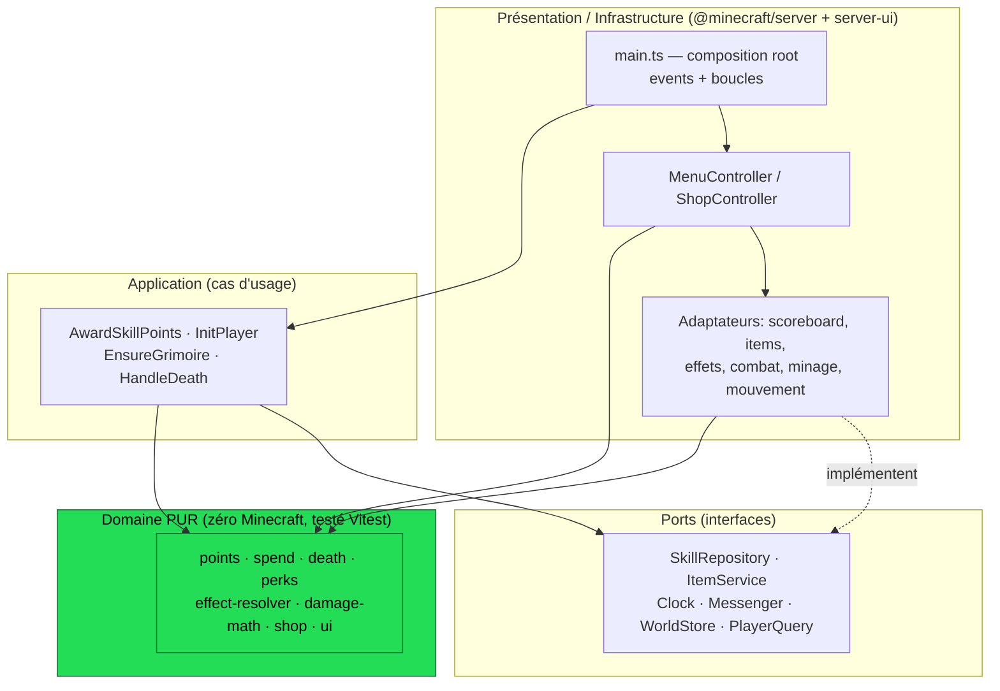
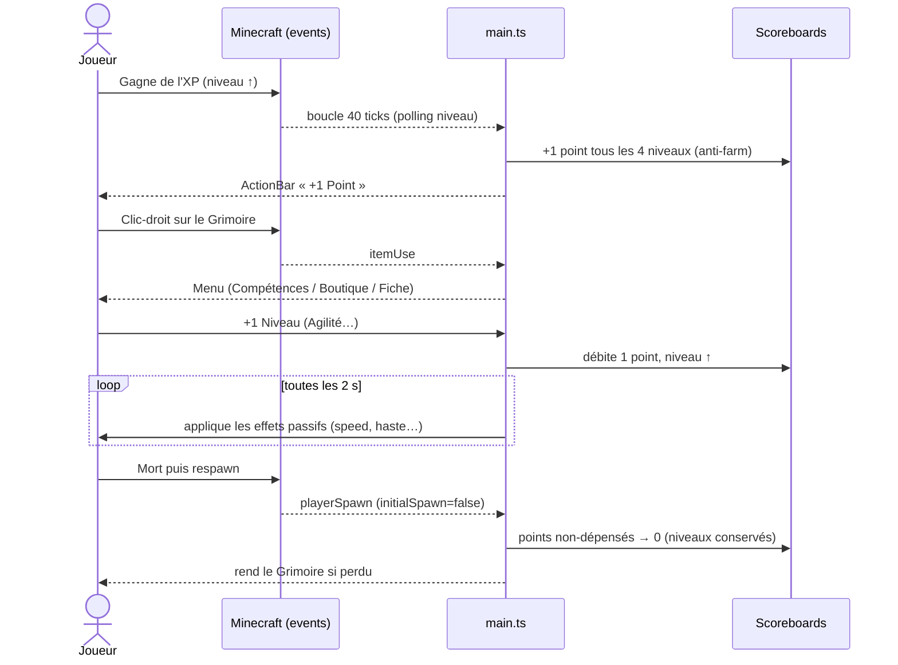

# 🌰 Marron Town — Add-on RPG (Minecraft Bedrock 1.21+)

Add-on **Minecraft Bedrock Edition** qui greffe un système de **progression RPG** sur l'XP
vanilla : on gagne des **points de compétence**, on les investit dans **4 arbres** (Agilité,
Attaque, Résistance, Minage, niv. 0–100), et on dépense ses points dans une **boutique rotative
toutes les 12 h**. Tout passe par un objet craftable, le **Grimoire des Compétences** — aucune
commande chat. Multijoueur (Realm/serveur), 100 % vanilla-compatible.

> Conçu « craftsman » : la **logique de jeu est en TypeScript pur et testée** (Vitest), le moteur
> Minecraft est cantonné à une couche d'infrastructure (architecture hexagonale). Le code est
> transpilé en `scripts/main.js`, le seul fichier que Bedrock exécute.

> 🎮 **Joueurs :** tout est expliqué dans le **[Guide du joueur](docs/README.md)** (`docs/`).

---

## Grandes lignes du mod

| Système | Comportement |
|---|---|
| **Grimoire des Compétences** | Objet craftable (**bâton + papier + or brut**, alignés). Clic-droit → ouvre le menu. **Nommé d'après son créateur** et **conservé à la mort** (rendu au respawn). Chaque joueur ne voit que sa propre fiche. |
| **Points de compétence** | 1 point tous les **4 niveaux** Minecraft. Anti-farm : seuls les paliers *jamais atteints* comptent (se suicider pour remonter ne donne rien). |
| **4 arbres (0–100)** | 1 point = 1 niveau. Effets passifs recalculés toutes les 2 s + paliers (10, 20, … 100). |
| **Mort** | Niveaux et achats **conservés**, points **non-dépensés perdus**. |
| **Boutique 12 h** | 3 communs + 2 rares, graine de monde déterministe, **1 achat par item par rotation et par joueur**. |
| **Persistance** | Scoreboards `marrontown_*` (survivent aux redémarrages). |

### Les 4 arbres (extraits)

- **⚡ Agilité** — vitesse, double saut, dash (double-Sneak), réduction/annulation de chute, esquive.
- **⚔️ Attaque** — bonus de dégâts, hâte, critiques, saignement, exécution, berserker.
- **🛡️ Résistance** — réduction hybride, régénération, absorption, résistance au feu, bastion (bouclier), second souffle.
- **⛏️ Minage** — hâte, Vein Miner, Toucher de Soie, Fortune, Minage Explosif (en accroupi).

---

## Architecture (hexagonale)



La règle de dépendance pointe vers le domaine : **`infrastructure → application → ports`,
`application → domaine`, `domaine → rien`.**

### Flux d'une partie



---

## Structure du projet

```
behavior_pack/        # Pack comportement
  manifest.json       #   deps @minecraft/server 1.19.0 + server-ui 1.3.0
  items/ recipes/     #   Grimoire (item + recette)
  scripts/main.js     #   bundle généré (ne pas éditer)
resource_pack/        # Pack ressources (texture + lang + icône)
src/
  domain/             # PUR, testé Vitest (points, perks, shop, combat-math, ui)
  ports/              # interfaces (DIP)
  application/        # cas d'usage (testés avec doublures)
  infrastructure/     # adaptateurs @minecraft/server + server-ui
  main.ts             # composition root (events + boucles)
scripts/              # build helpers : deploy, package, gen-texture
```

---

## Commandes

```bash
npm install
npm test           # tests unitaires du domaine + cas d'usage (sans Minecraft)
npm run build      # transpile src/ -> behavior_pack/scripts/main.js
npm run package    # build + dist/marron-town-mod.mcaddon (distribuable)
npm run deploy     # build + copie dans com.mojang (test en jeu, Windows)
```

## Installation / test en jeu

1. `npm run package` → `dist/marron-town-mod.mcaddon`. Double-clic → import dans Minecraft
   (« Comportements disponibles » **et** « Ressources disponibles »).
2. Crée/édite un monde, active les **deux** packs.
3. Active **« Beta APIs »** dans les options du monde (Script API).
4. Fabrique le Grimoire et clique dessus pour ouvrir le menu.

> En développement : `npm run deploy` copie les packs dans
> `development_*_packs/` ; relance le monde après chaque `npm run build`.

---

## Écarts assumés vs cahier des charges (l'API Bedrock ne permet pas tout)

L'API ne peut pas annuler un dégât, et certains events n'existent pas. Choix retenus
(reconçus en équivalents 100 % faisables, voir [docs/plan]) :

| Mécanique d'origine | Solution retenue |
|---|---|
| Réduction / esquive de dégâts | **Hybride** : effet `resistance` (réduction réelle avant le coup) + *heal-back* du résidu. L'esquive ne stoppe pas un one-shot. |
| `playerLevelChange` (inexistant) | Polling du niveau toutes les 2 s. |
| Bastion (`isBlocking` inexistant) | Bonus actif tant qu'un **bouclier est en main secondaire**. |
| Immunité Momentanée | **Second souffle** : sous 15 % PV, 1×/min → Absorption + Régén + Résistance. |
| Minage Explosif (« clic maintenu ») | Déclenché **en accroupi** sur cassage (zone 3×1). |
| Autel unique (bloc custom) | Remplacé par le **Grimoire** (objet), plus simple et robuste. |

---

## Notes

- Le namespace interne est `marrontown:` ; les scoreboards sont préfixés `marrontown_`.
- La texture du Grimoire (`resource_pack/textures/items/skill_grimoire.png`) est un placeholder
  16×16 généré par `scripts/gen-texture.mjs` — remplaçable par une vraie texture Blockbench.
- Régénère les **UUID** des manifests avant une publication publique si tu forkes le projet.
```
